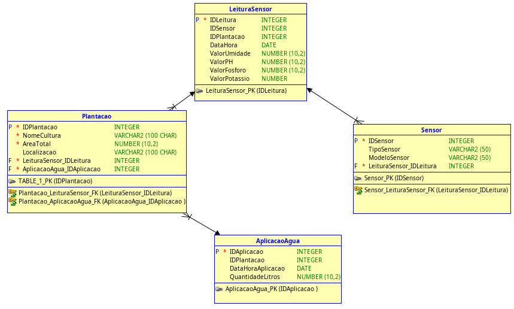

# FarmTech Solutions – Modelagem de Banco de Dados

 📘 Descrição:
Projeto de modelagem de banco de dados relacional para sensoriamento agrícola digital. O sistema foi projetado para armazenar e analisar dados de sensores de umidade, pH e nutrientes, além de controlar a aplicação de água em plantações.

---

 🧱 Entidades e Atributos

 🌾 Plantacao
- IDPlantacao (PK) – INTEGER
- NomeCultura – VARCHAR(100)
- AreaTotal – NUMERIC(10,0)
- Localizacao – VARCHAR(100)

 📟 Sensor
- IDSensor (PK) – INTEGER
- TipoSensor – VARCHAR(50)
- ModeloSensor – VARCHAR(50)

 📊 LeituraSensor
- IDLeitura (PK) – INTEGER
- IDSensor (FK) – INTEGER
- IDPlantacao (FK) – INTEGER
- DataHora – DATE
- ValorUmidade – NUMERIC(5,2)
- ValorPH – NUMERIC(5,2)
- ValorFosforo – NUMERIC(5,2)
- ValorPotassio – NUMERIC(5,2)

 💧 AplicacaoAgua
- IDAplicacao (PK) – INTEGER
- IDPlantacao (FK) – INTEGER
- DataHoraAplicacao – DATE
- QuantidadeLitros – NUMERIC(10,0)

---

 🔗 Relacionamentos

- Uma `Plantacao` pode ter várias `LeituraSensor`
- Uma `Plantacao` pode ter várias `AplicacaoAgua`
- Um `Sensor` pode gerar várias `LeituraSensor`

---

🖼️ Diagrama DER

---

  👨‍💻 Desenvolvedor

- Enrico Domenico – RM561352  
- Fase 2 – Capítulo 12 – FIAP
